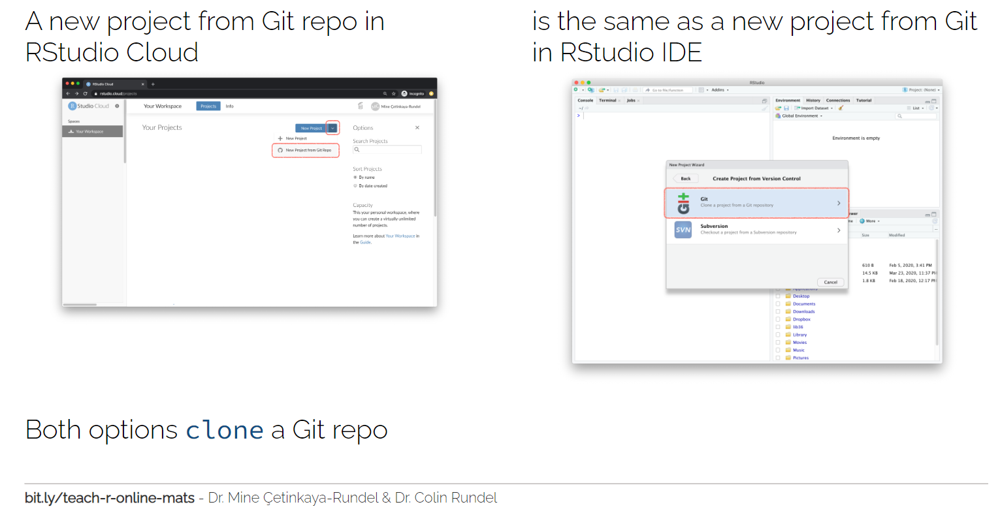
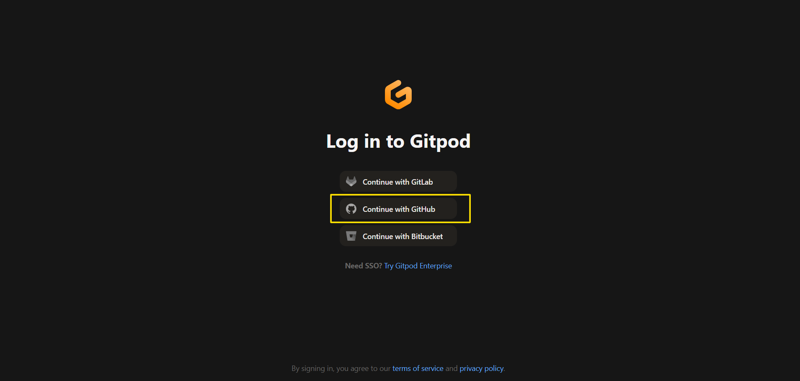
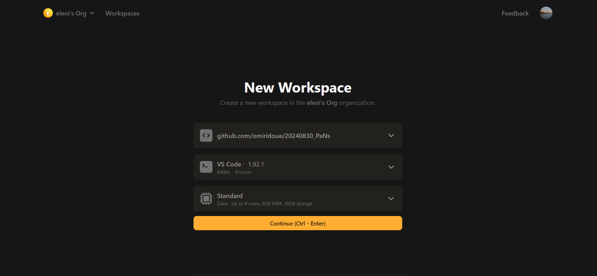
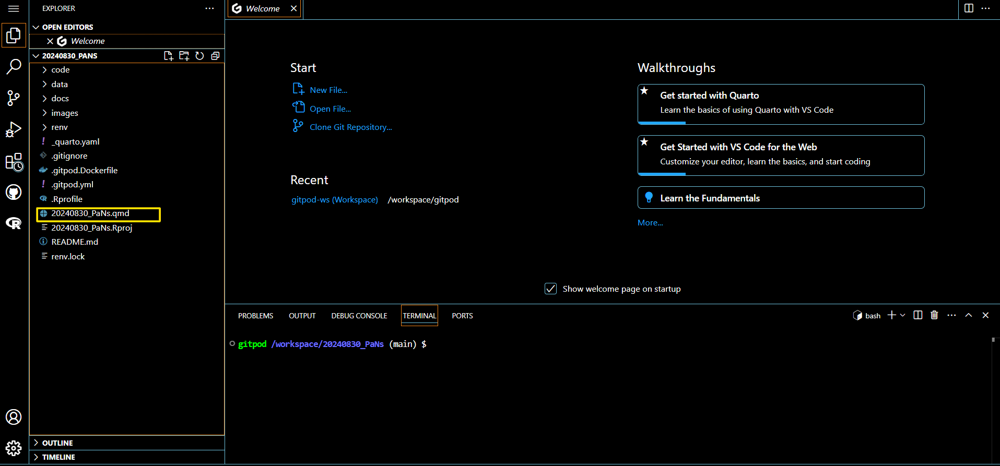
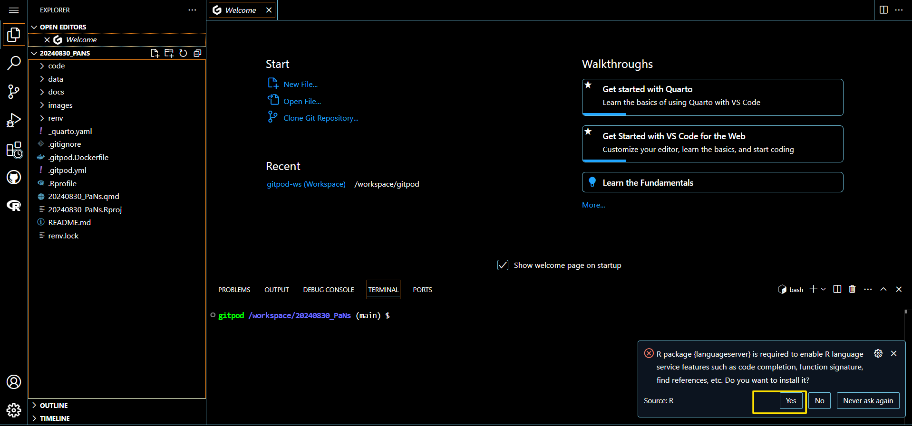
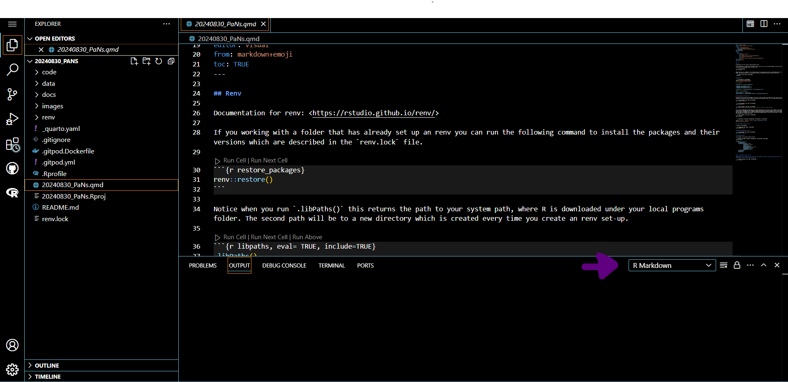
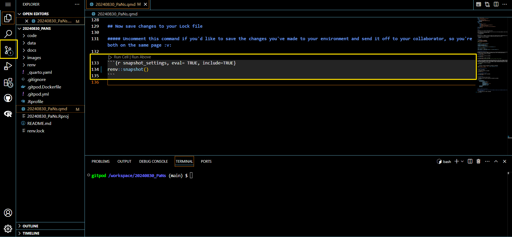

# To Follow Along Launch a Workspace

You can set up an account or sign up with GitHub. You can access the workspace by cloning the following repository. This saves the hassle of setting up on your local computer.

You will just need to copy the following URL to set up the repository, https://github.com/omiridoue/20240830_PaNs

## GitPod 

GitPod is an alternative to RStudio Cloud. The free plan involves 50 hours unlike 25 hours in RStudio Cloud. While the latter keeps RStudio as an IDE the former lets you pick from a couple of options. Your choice will depend on your purpose and motivation to work on a project. Both are based
off a similar concept, they establish a remote connection to a Linux machine. 

### [Optional] Step 1: Follow the Invite Link to Join as Collaborator

https://gitpod.io/orgs/join?inviteId=aec2e432-0cfb-46f5-bf82-cd4bd61d60fb

### Step 2: Click the Button Below to Launch Workspace for this Repo

> This is a pre-built container. Once you've created the workspace re-launching it won't require much work as any installation will be cached. It just means we'll all be working with the same set-up. Just let it do its thing in the background, make sure you don't close the browser and maintain a stable Internet connection. You won't need to download anything to your computer. 

You have 50 hours free work time per month! This is quite generous and means you can make use of it for collaborative projects in the future. 

### Step 3: Sign in through GitHub Account

### Step 4: Make Sure you've Selected the 20240830_PaNs Current Repository

### Step 5: Click on the Quarto File we'll be working with

### Step 6: Click Yes to Install R Language Interpreter

or if there is no pop-up, try changing the language console from R to RMarkdown 

### Step 7: Make Changes to the File

Once you work your way through loading the renv pre-specified files in the `renv.lock` you will install additional packages along the way. To save these to your lock file you will need to uncomment the following line of code in the final chunk, `renv::snapshot()`. Click `Ctrl+S` to save changes to your quarto file. As soon as you do this you will see the version control on the left pane has flagged to you that something's changed. To practice using git you will need to click onto the tab below and follow the steps to committing your upadated qmd file and `renv.lock` files. Note because you don't have owner access to the repository you will be prompted to fork 
the repository before you're able to commit any changes. Then you can follow along additional steps through GitHub to merge your updated code to the original repository
you are contributing to through a merge pull request, this might be a task for another day though. Well done ✨✨ !

